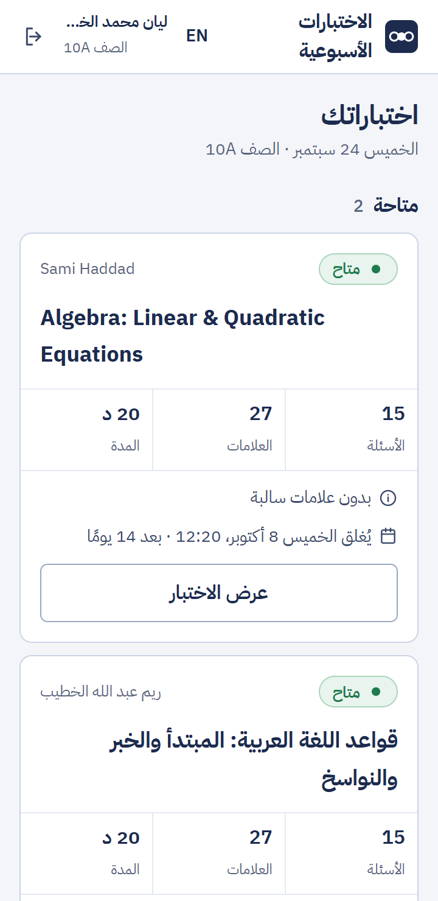
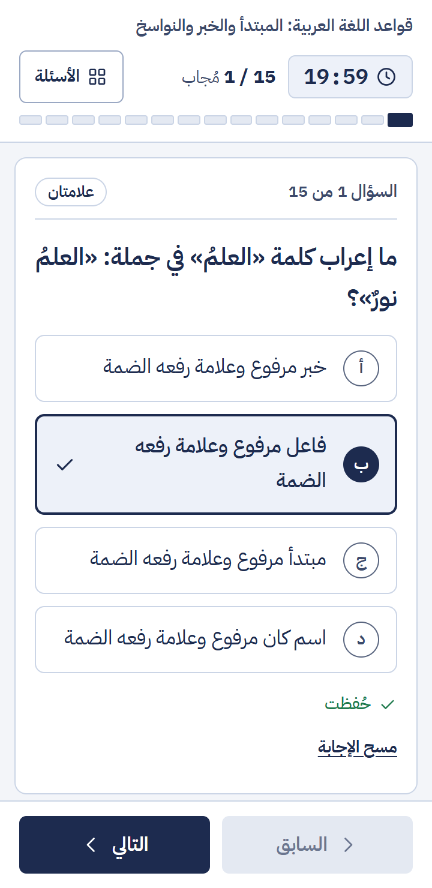
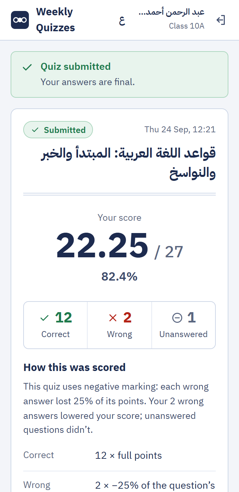
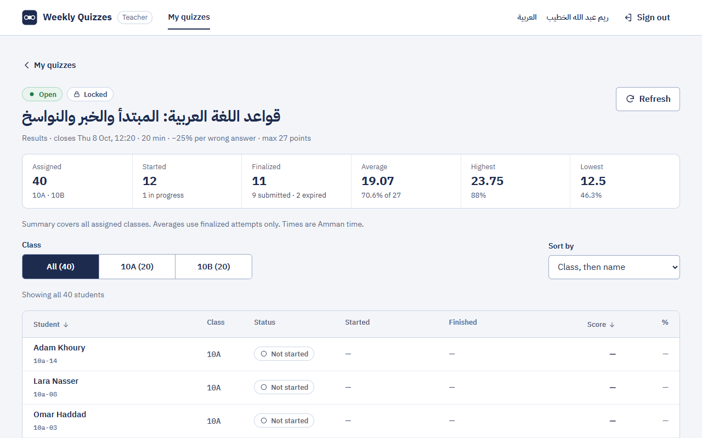
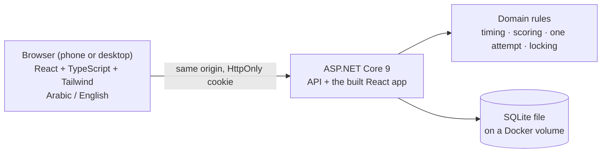

# Tutoring Quiz: weekly quizzes for Nour's tutoring centre

[](https://github.com/at128/tutoring-quiz/actions/workflows/ci.yml) · **Live demo: https://quiz.just-atta.site** · Arabic and English · phone first

Students sign in on their phones, take a timed multiple-choice quiz **once**, and see their score. Teachers write quizzes, schedule them for one or more classes, choose how wrong answers are marked, see every student's answers, and decide when students see their scores. The server owns the clock and the scoring, so a refresh, a locked phone or a second tab never costs a student an answer, and nobody can grade themselves.

| Student (phone, Arabic) | | Result (phone, English) | Teacher results (desktop) |
|---|---|---|---|
|  |  |  |  |

## Run it: one command

Requirements: Docker Desktop (or Docker Engine with Compose v2). Nothing else: no .NET, no Node, no database to install.

```bash
git clone https://github.com/at128/tutoring-quiz.git && cd tutoring-quiz
docker compose up --build
```

Open **http://localhost:8080**. On first start the database is created, migrated and filled with sample data.

**Even easier:** a helper checks that Docker is running, picks a free port, waits until the app answers, and prints the address for this computer **and for a phone on the same Wi-Fi**:

| macOS, Linux, Git Bash, WSL | Windows |
|---|---|
| `./run.sh` | double-click `run.cmd`, or `.\run.cmd` in a terminal |
| `./run.sh --reset` starts over with fresh sample data · `./run.sh --stop` stops it | `run.cmd --reset` · `run.cmd --stop` |

Port 8080 busy? `APP_PORT=8081 docker compose up --build` (PowerShell: `$env:APP_PORT=8081; docker compose up --build`), or just use the helper.

## Sample accounts
Each student can take each quiz **once**, so several untouched accounts are reserved for you.

| Role | Username | Password | What you'll see |
|---|---|---|---|
| Student 10A | `10a-01` … `10a-05` | `Student@2026` | Arabic grammar (open, 25 % negative marking), Algebra (open), Physics in Arabic (upcoming, a fixed 0.5 mark per wrong answer) |
| Student 10B | `10b-01` … `10b-05` | `Student@2026` | Arabic grammar (open), Physics (upcoming), English Unit 4 (closed: missed) |
| Student 11A | `11a-01` … `11a-05` | `Student@2026` | Algebra (open), English Unit 4 (closed: missed) |
| Teacher | `teacher.reem` | `Teacher@2026` | Arabic grammar quiz with results already coming in |
| Teacher | `teacher.lina` | `Teacher@2026` | Closed English quiz with a full set of results: open a student's answers, or correct the quiz and watch the results recalculate |
| Teacher | `teacher.sami` | `Teacher@2026` | Algebra (open) and a draft Geometry quiz |
| Teacher | `teacher.khaled` | `Teacher@2026` | Upcoming Physics quiz (still editable) |

Usernames aren't case-sensitive. There is no admin role (see `DECISIONS.md`). The live demo is shared, so someone may already have used an account; `./run.sh --reset` locally always gives fresh ones.

## What it does

**Students**
- See their quizzes: available, upcoming (with the time it opens), in progress, completed, missed.
- A timed quiz on the phone: answers save the moment they're chosen, the timer is `deadline − server time`, and "only 8 minutes left" is said before starting near the close.
- Refresh, lock the phone, lose the connection, open a second tab: the attempt resumes with every saved answer. Time-up finishes it with what was saved.
- The score with how it was calculated, or, when the teacher hides scores, a calm "answers received, score hidden for now".

**Teachers**
- Write quizzes: Arabic or English text, 2–6 options, points per question, several classes, opening and closing times, a time limit.
- Negative marking per quiz: **none**, a **percentage** of the question's points (25 %, 33 %, 50 % or custom), or a **fixed mark** per wrong answer. A deduction never exceeds the question's points, and a total never goes below 0.
- Results per class: who finished, who is still answering, who never started or missed it; averages, highest and lowest.
- **Each student's answers**, question by question: what they chose, the correct option, points earned, deductions.
- **Show or hide scores** from students at any time. Hidden scores never leave the server.
- **Correct a quiz after it closes** (a wrong answer key, points, marking): every student's result is recalculated in the same transaction, from the answers they actually gave.

**Both:** the whole interface in **Arabic or English** (it follows the phone's language, with a switch), right-to-left done properly, Western digits, Arabic names everywhere.

## Try to break it
- Start a quiz in two tabs, or twice after submitting: you get one attempt (a database unique index, not a UI check).
- Change the phone's clock: nothing changes, the server decides the time.
- Let the timer run out: the attempt finishes with the saved answers only; an answer sent a second late is refused.
- As a student, open a teacher URL, or another student's attempt: 403 / 404.
- Edit a quiz while students are taking it: refused. After it closes: allowed, and every result is recalculated.
- Hide the scores, then look at the student's API responses: the score isn't there.
- Post to the API from another website: refused (same-origin guard).

## How it's built



- **Clean Architecture, kept lean:** `Domain` (rules, no dependencies) → `Application` (one handler per use case) → `Infrastructure` (EF Core + SQLite) → `Api`. No MediatR, no generic repositories, no AutoMapper.
- **One container** serves the API and the React app from the same origin: no CORS, cookie auth, ProblemDetails errors with a stable `code` for every failure.
- **Each rule that matters lives in one place:** deadlines in `AttemptTiming`, scoring in `QuizScoring` (results, regrading and the teacher's answer view all use it, so they always agree), editing rules in `Quiz`.

More in `docs/ARCHITECTURE.md`, `docs/DOMAIN.md` and `docs/API.md`.

## Tests

```bash
dotnet test                                            # domain rules + HTTP integration tests on real SQLite files
cd frontend && npm ci && npm run lint && npm run typecheck && npm test && npm run build
```

Browser tests (Playwright) run against the real container:

```bash
APP_PORT=18081 docker compose -p tq-e2e up -d --build   # fresh data each time: `down -v` before a rerun
cd frontend && npx playwright install chromium && npm run test:e2e
```

- **Backend:** the integration tests run the real API against a fresh SQLite file and a fake clock: the one-attempt rule under concurrent starts, deadline boundaries, lazy expiry, scoring with both kinds of negative marking and the zero floor, answer-key secrecy, ownership and roles, CSRF, validation limits, editing a closed quiz and regrading, hidden scores, and the teacher's answer view.
- **Frontend:** unit tests for autosave, the timer, the server clock, editor validation and serialization, results sorting, and the Arabic interface (dictionary parity, plurals, dates, no hard-coded text).
- **Browser:** an Arabic phone journey, an English desktop journey, a teacher-to-student journey, editor edge cases.
- **CI:** GitHub Actions runs `backend`, `frontend`, `docker` (image build) and `e2e` (browser tests against the running container) on every push and pull request.

## Sample data
Loaded from plain files in `seed/`: `classrooms.csv`, `teachers.csv`, `students.csv` (60 students in 10A, 10B and 11A) and `quizzes.json` (4 quizzes of 15 questions, plus 1 draft). Quiz dates are relative to the first start, so the demo always has open, upcoming and closed quizzes. To load a centre's real lists, replace the CSV files (Excel's "CSV UTF-8" export works) and reset the data. Details: `docs/SEED_DATA.md`.

## Try it on a phone
Put the phone and the computer on the same Wi-Fi and open the phone address that `./run.sh` / `run.cmd` prints (`http://<your-computer's-LAN-IP>:8080`). The sign-in cookie works over plain HTTP on the LAN; behind HTTPS it's `Secure`.

## Run without Docker
Requirements: .NET SDK 9 and Node.js 24.
```bash
dotnet run --project src/TutoringQuiz.Api            # API on http://localhost:5080 (seeds on first run)
cd frontend && npm ci && npm run dev                   # app on http://localhost:5173 (proxies /api to :5080)
```
The development database is `src/TutoringQuiz.Api/tutoringquiz.db`. Delete it to reseed.

## Project structure
```
src/
  TutoringQuiz.Domain          entities and rules: timing, scoring, one attempt, locking, regrading (no dependencies)
  TutoringQuiz.Application     use cases (one handler per action), validation, views
  TutoringQuiz.Infrastructure  EF Core + SQLite, migrations, password hashing, seeding
  TutoringQuiz.Api             controllers, cookie auth, CSRF guard, ProblemDetails errors, rate limit, serves the SPA
frontend/                      React + TypeScript + Vite + Tailwind; features/{auth,student,teacher}; i18n; e2e/
tests/                         Domain tests and API integration tests (xUnit)
seed/                          sample classes, teachers, students and quizzes
deploy/                        the live demo's server-side deploy and backups (not needed to run the project)
docs/                          brief, architecture, domain rules, API contract, design, test plan, reviews, AI logs
run.sh · run.cmd               the one-command helpers
```

## Live demo
https://quiz.just-atta.site runs the newest commit of `main` whose CI passed. The server pulls and deploys it itself (no SSH key or server address on GitHub), rolls back if the health check fails, and backs up the database every day and before every deploy. See `deploy/README.md`.

## Troubleshooting
- **Docker isn't running.** Start Docker Desktop and wait until it says it's running; the helpers check this for you.
- **Port 8080 is in use.** The helpers pick the next free port; or use `APP_PORT=8081`.
- **Stale data or a strange state.** `./run.sh --reset` (or `docker compose down -v && docker compose up --build`).
- **A phone can't reach the computer.** Same Wi-Fi, and allow Docker Desktop through the firewall on private networks.
- **"Too many sign-in attempts."** 10 per minute for one username from one network, 100 per minute from one network. Wait a minute.
- **Times look shifted.** Times are stored in UTC and shown in your device's time zone.

## More
- `DECISIONS.md`: what the brief didn't say and what was decided
- `AI_USAGE.md`: how AI tools were used and checked
- `AGENTS.md`, `CLAUDE.md`, `docs/WORKFLOW.md`, `prompts/`: the agent configuration and prompts actually used
- `docs/reviews/`: the independent reviews and their outcomes
